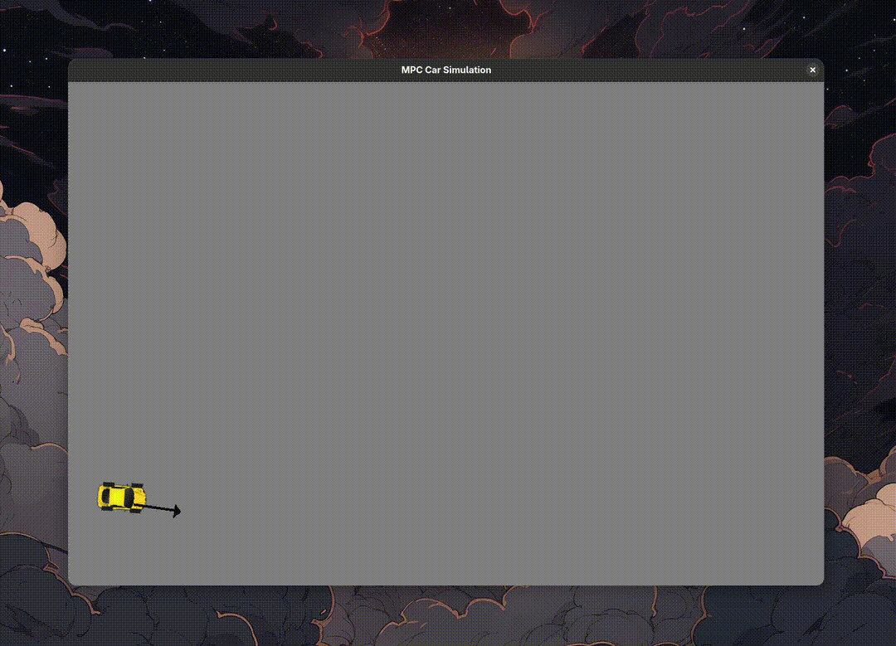
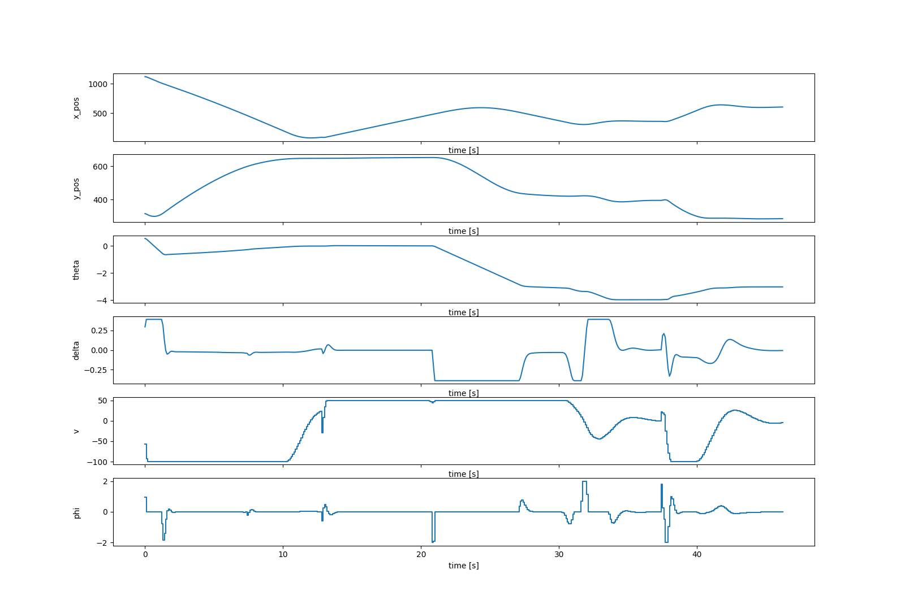

# MPC Car Simulation

<br>
<div align="center">
  
  <br>
  <em>Demo of the MPC car simulation.</em>
</div>
<br>

This project implements a Model Predictive Control system for a kinematic car model in a 2D simulated environment using `do-mpc` and `CasADi`. The simulation allows for real-time interaction, where users can set a target position and heading for the car, which is controlled to follow the desired trajectory.

<br>
<div align="center">
  
  <br>
  <em>Results of the MPC simulation showing state and control variables.</em>
</div>
<br>

## Features

* Real-time 2D simulation using `pygame`
* Kinematic bicycle model with steering and velocity control
* Interactive setpoint selection with the mouse
* MPC optimization via `do-mpc` and `CasADi`
* Visual tracking of key state and control variables (`x`, `y`, `θ`, `δ`, `v`, `ϕ`) via `matplotlib`

## Setup

1. Setup a Python virtual environment (optional but recommended):

```bash
python3 -m venv .venv
source .venv/bin/activate
```

2. Install the required packages:

```bash
pip install -r requirements.txt
```

3. Run the simulation:

```bash
python3 main.py
```

* **Click and drag** in the simulation window to update the setpoint and desired heading.
* Press **Q** or close the window to exit. The plots will be shown after the simulation ends.

## License

This project is licensed under the MIT License. See the [LICENSE](LICENSE.md) file for details.
